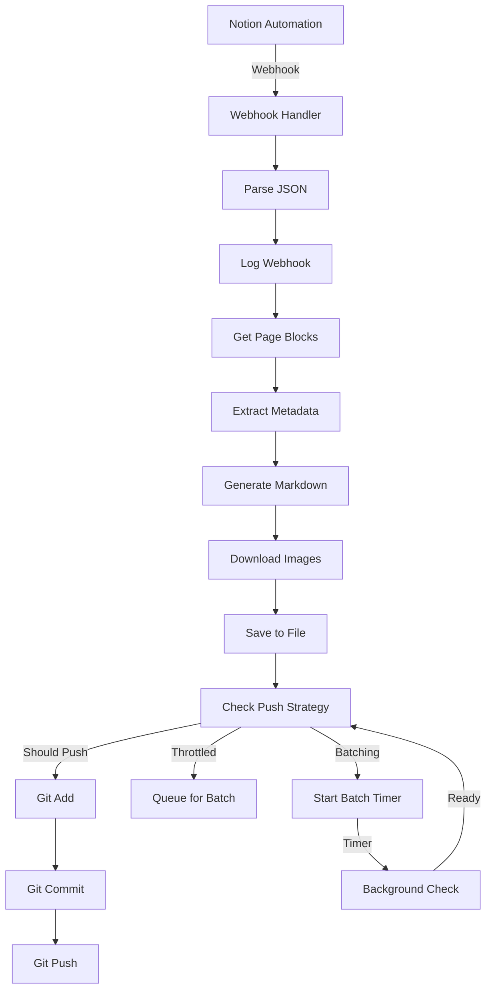

## 项目背景

在现代内容创作流程中，Notion已成为许多团队和个人的首选工具。它提供了强大的数据库管理、协作编辑和灵活的结构化数据能力。然而，对于使用静态站点生成器（如Astro、Hugo、Gatsby）的博客来说，如何高效地将Notion中的内容同步到静态站点一直是一个挑战。

传统的同步方案通常需要：

- 手动复制粘贴内容
- 复杂的API集成
- 不灵活的字段映射
- 频繁的构建触发
本项目旨在解决这些问题，提供一个自动化、灵活、智能的Notion到静态博客的转换方案。

## 设计目标

### 核心目标

1. 自动化: Webhook驱动，无需手动操作
1. 灵活性: 支持自定义字段映射和多种SSG
1. 高效性: 智能推送策略，避免过度构建
1. 可维护性: 清晰的模块化设计，易于扩展
1. 稳定性: 完善的错误处理和日志记录
### 非功能目标

- 性能: 单次转换 < 5秒
- 可用性: 99.9%服务可用性
- 可扩展性: 支持多实例部署
- 安全性: 不存储敏感数据，配置与代码分离
## 系统架构

### 整体架构图

```plain text
┌─────────────────────────────────────────────────────────────┐
│                        客户端层                                │
├───────────────────┬───────────────────┬─────────────────────┤
│   Notion Automation   │   Manual Webhook   │   API Client        │
└─────────┬─────────┴─────────┬─────────┴─────────┬─────────────┘
          │                   │                     │
          └───────────┬───────┘                     │
                      │                             │
          ┌───────────▼──────────┐                  │
          │   Webhook端点         │                  │
          │  /webhook/notion/auto│                  │
          └───────────┬──────────┘                  │
                      │                             │
          ┌───────────▼──────────┐                  │
          │   WebhookHandler     │                  │
          │   (请求处理)          │                  │
          └───────────┬──────────┘                  │
                      │                             │
    ┌─────────────────▼──────────────────┐          │
    │        Handler Orchestrator         │          │
    │  - 参数验证                        │          │
    │  - 日志记录                        │          │
    │  - 错误处理                        │          │
    └───────────┬──────────┬────────────┘          │
                │          │                        │
    ┌───────────▼──┐   ┌──▼──────────────┐         │
    │ NotionClient │   │  GitHubClient   │         │
    │   (API调用)   │   │   (推送)        │         │
    └──────┬───────┘   └───────┬────────┘         │
           │                   │                   │
    ┌──────▼──────────┐  ┌─────▼────────┐         │
    │   Converter     │  │ PushManager  │         │
    │  (转换逻辑)      │  │  (策略管理)   │         │
    └──────┬──────────┘  └─────┬────────┘         │
           │                   │                   │
    ┌──────▼──────────┐  ┌─────▼────────┐         │
    │  File System    │  │ Git Repository│         │
    │  (文件存储)      │  │  (远程推送)    │         │
    └─────────────────┘  └──────────────┘         │
                                                       │
    ┌──────────────────────┬──────────────────────────┘
    │     Config &
    │   Logger Modules
    └──────────────────────┘

```

### 核心组件

### 1. Webhook Handler (internal/handler/)

职责: 接收并处理Webhook请求

关键特性:

- JSON请求体解析和验证
- Webhook数据的结构化存储
- 异常情况的错误处理
- 详细的操作日志记录
设计决策:

- 使用Gin框架处理HTTP请求
- 同步处理保证数据一致性
- 错误时返回详细错误信息便于调试
### 2. Notion Client (internal/notion/)

职责: 与Notion API交互

关键功能:

- 获取页面详细信息
- 提取页面内容块
- 处理图片和媒体文件
实现方式:

- 纯Go实现，无第三方依赖
- 使用标准库http.Client进行API调用
- 智能重试机制处理临时网络问题
设计决策:

- 为什么不使用官方SDK？
  - 减少依赖
  - 更好的错误控制
  - 精确控制API行为
### 3. Converter (internal/converter/)

职责: 将Notion数据转换为Markdown

子模块:

- Mapper (mapper.go): 提取结构化数据
- Markdown (markdown.go): 生成Markdown内容
转换流程:

```plain text
Notion Page JSON
       ↓
   Field Extraction (Mapper)
       ↓
  Metadata Object
       ↓
  Markdown Generator
       ↓
   File Content
       ↓
   Save to File

```

字段映射设计:

```go
type FieldMapping struct {
    Title       string `yaml:"title"`        // Notion字段 → Markdown字段
    Slug        string `yaml:"slug"`
    PublishDate string `yaml:"publish_date"`
    // ... 更多字段
}

```

关键特性:

- 动态类型处理（title、rich_text、multi_select等）
- 可配置的字段映射
- 日期格式化
- 封面图片处理
设计模式:

- 策略模式: 不同字段类型使用不同提取策略
- 构建器模式: Markdown内容逐步构建
### 4. GitHub Client (internal/github/)

职责: 管理GitHub仓库的推送

子模块:

- Client (client.go): 执行git操作
- Strategy (strategy.go): 管理推送策略
Git操作流程:

```plain text
Check Changes
       ↓
   git add .
       ↓
 git commit -m "message"
       ↓
  git push origin branch

```

智能推送策略:

节流机制:

- 限制指定时间窗口内的推送次数
- 例如: 60分钟内最多推送1次
- 防止CI/CD系统过载
批处理机制:

- 延迟推送，等待更多变更
- 例如: 5分钟内合并所有变更
- 减少构建频率
状态机:

```plain text
[Idle] ---> [Batching] ---> [Pushed]
    ↑              ↓              ↓
    └────[Timer]───┘              │
         (wait for timeout)       │
                                   │
    [Throttled] <----------------──┘
    (cannot push yet)

```

关键实现:

```go
type PushManager struct {
    lastPushTime  time.Time
    pushCount     int
    pendingChanges bool
    batchTimer    *time.Timer
    // ...
}

```

### 5. 配置管理 (internal/config/)

职责: 统一管理系统配置

配置来源优先级:

1. 环境变量（最高优先级）
1. config.yaml文件
1. 默认值（最低优先级）
配置项:

- Notion API配置
- 输出目录配置
- 字段映射配置
- GitHub推送配置
- 推送策略配置
- 日志配置
设计模式:

- 单例模式: 全局配置对象
- 构建器模式: 逐步加载配置
### 6. 日志系统 (internal/logger/)

职责: 结构化日志记录

特性:

- 多级别日志（info、warn、error）
- 日志轮转（避免文件过大）
- 同时输出到控制台和文件
- Webhook数据完整记录
日志文件结构:

```plain text
logs/
├── info.log      # 一般信息
├── warn.log      # 警告信息
├── error.log     # 错误信息
└── webhook/      # Webhook原始数据
    └── {page_id}/
        └── {timestamp}.json

```

### 7. 工具模块 (internal/utils/)

职责: 提供通用工具函数

主要功能:

- 图片下载和处理
- 文件系统操作
- URL处理
- 相对路径计算
图片处理流程:

```plain text
Image URL in Markdown
       ↓
   Download Image
       ↓
   Generate Filename
       ↓
   Save to output_image_dir
       ↓
   Calculate Relative Path
       ↓
   Replace URL in Markdown

```

## 工作流程

### 完整数据流



### 详细时序图

```plain text
Client          Server          Notion        GitHub
 │                │               │             │
 │  Webhook POST  │               │             │
 │────────────────>│               │             │
 │                │               │             │
 │                │─Get Blocks───>│             │
 │                │<──Blocks─────│             │
 │                │               │             │
 │                │─Convert to Markdown──┐      │
 │                │<───────────────┘      │
 │                │                       │
 │                │─Save File──────────┐  │
 │                │<──────────────────┘  │
 │                │                       │
 │                │  Check Strategy       │
 │                │─Should Push?───────>  │
 │                │<──Yes────────────────│
 │                │                       │
 │                │─git add .──────────┐  │
 │                │<──────────────────┘  │
 │                │                       │
 │                │─git commit──────────┐ │
 │                │<───────────────────┘ │
 │                │                       │
 │                │─git push origin─────>│
 │                │<───────OK────────────│
 │                │                       │
 │  Response      │                       │
 │<───────────────│                       │
 │                │                       │

```

## 技术栈

### 核心技术

### 依赖管理

```plain text
go.mod 文件关键依赖:
- github.com/gin-gonic/gin  v1.9.1    # Web框架
- gopkg.in/yaml.v2         v2.4.0    # YAML解析

```

依赖最小化原则:

- 能用标准库绝不用第三方
- 优先选择经过验证的稳定库
- 避免引入不必要的复杂性
## 关键设计决策

### 1. 为什么使用Webhook而不是轮询？

Webhook方案:

- ✅ 实时性强
- ✅ 资源消耗低
- ✅ 由Notion触发，简化逻辑
- ❌ 需要公网访问
轮询方案:

- ❌ 频繁API调用，成本高
- ❌ 难以确定轮询频率
- ❌ 可能错过快速连续的变化
决策: 选择Webhook，因为博客更新频率不高，实时性更重要

### 2. 为什么不在转换时直接推送？

直接推送:

- ❌ 可能频繁触发构建
- ❌ 多个快速连续的更新会产生多个commit
- ❌ 难以合并相关更新
策略推送:

- ✅ 智能节流，避免过度构建
- ✅ 批处理相关更新
- ✅ 可配置的推送策略
决策: 实现推送策略，提供最大灵活性

### 3. 为什么使用文件存储而不是数据库？

文件存储:

- ✅ 简单，无需额外依赖
- ✅ 易于备份和迁移
- ✅ 与静态站点生成器无缝集成
- ❌ 难以查询
数据库:

- ❌ 增加系统复杂性
- ❌ 需要迁移脚本
- ❌ 与目标架构（静态站点）不匹配
决策: 使用文件系统，因为目标就是生成静态文件

### 4. 为什么选择JSON而不是Protocol Buffers？

JSON:

- ✅ 人类可读，便于调试
- ✅ 与Web API天然兼容
- ✅ Notion原生支持
- ❌ 序列化开销稍大
Protocol Buffers:

- ❌ 不易调试
- ❌ 额外工具链
- ❌ 与现有生态不匹配
决策: 使用JSON，调试便利性更重要

### 5. 为什么不使用消息队列？

当前设计:

- 同步处理，逻辑简单
- 无需额外基础设施
- 易于理解和维护
消息队列（可选扩展）:

- ✅ 解耦请求和处理
- ✅ 更好的可扩展性
- ✅ 失败重试机制
- ❌ 增加系统复杂性
决策: 当前不需要，未来可扩展为异步模式

## 性能优化

### 1. 图片处理优化

- 并发下载: 使用goroutine并发下载多张图片
- 超时控制: 设置合理的HTTP超时避免阻塞
- 路径优化: 提前计算相对路径减少字符串操作
- 文件缓存: 避免重复下载相同图片（可扩展）
### 2. 内存优化

- 流式处理: 大文件边读边写，不加载到内存
- 对象池: 重用JSON解析对象（可扩展）
- 及时释放: 处理完成后及时清理引用
### 3. 网络优化

- 连接复用: HTTP客户端使用连接池
- 压缩响应: API调用使用gzip压缩
- 智能重试: 指数退避算法
### 性能基准

## 错误处理

### 错误分类

### 1. 可重试错误

- 网络超时
- 临时API错误
- Git网络问题
处理策略: 指数退避重试（最多3次）

### 2. 不可重试错误

- 配置错误
- 权限不足
- 数据格式错误
处理策略: 立即返回错误，记录日志

### 3. 部分失败

- 图片下载失败（部分成功）
- 转换成功但保存失败
处理策略: 标记部分成功，继续处理，记录警告

### 错误传播

```plain text
Notion API Error
       ↓
   Converter Error
       ↓
  Handler Error
       ↓
   HTTP Response
       ↓
    Client Logs

```

### 错误示例

```json
{
  "status": "error",
  "message": "Failed to fetch page blocks from Notion",
  "error": "Invalid API key",
  "pageID": "xxx-xxx"
}

```

## 安全性

### 1. 配置安全

- 敏感信息: API密钥、Token存储在环境变量或独立配置文件
- 文件权限: 配置文件设置600权限
- Git忽略: config.yaml加入.gitignore
### 2. 输入验证

- 参数校验: 验证所有输入参数
- 类型检查: 严格检查数据类型
- 长度限制: 限制字符串长度防止DoS
### 3. 资源限制

- 文件大小: 限制下载文件大小
- 并发数: 限制并发处理数量
- 超时: 所有外部调用设置超时
## 可扩展性

### 1. 水平扩展

当前设计支持多实例部署：

- 使用负载均衡器分发请求
- 每个实例独立工作
- 共享配置和状态（可选）
### 2. 垂直扩展

- 多核CPU利用（goroutine）
- 内存优化
- 缓存层（Redis，可选）
### 3. 功能扩展

- 多数据库支持: 扩展handler支持多路由
- 自定义转换器: 插件化转换逻辑
- 消息队列: 集成RabbitMQ/Kafka
- 监控系统: Prometheus指标
- 缓存层: Redis缓存Notion数据
## 测试策略

### 1. 单元测试

- 核心逻辑函数
- 字段映射逻辑
- 错误处理
### 2. 集成测试

- API集成
- 文件系统操作
- Git操作
### 3. 端到端测试

- 完整工作流
- Webhook处理
- 实际Notion数据库测试
### 测试覆盖率目标

- 语句覆盖率: > 80%
- 分支覆盖率: > 70%
- 关键路径: 100%
## 监控和运维

### 1. 日志监控

- 错误率监控
- 处理时间监控
- 推送频率监控
### 2. 健康检查

- /health 端点
- 外部依赖状态（Notion API）
- 磁盘空间检查
### 3. 告警

- 连续错误
- 处理时间过长
- 磁盘空间不足
## 部署方案

### 1. 本地开发

```bash
go run ./cmd/server

```

### 2. Docker部署

```docker
FROM golang:1.21-alpine
WORKDIR /app
COPY . .
RUN go build ./cmd/server
EXPOSE 8231
CMD ["./server"]

```

### 3. 云部署

- Railway: 零配置部署
- Render: 自动SSL
- Fly.io: 全球边缘网络
- Heroku: 简单扩展
### 4. 容器编排

- Docker Compose: 本地开发
- Kubernetes: 生产环境
## 性能监控建议

### 关键指标

1. QPS: 每秒请求数
1. 延迟: P50, P95, P99响应时间
1. 错误率: 4xx, 5xx错误比例
1. 推送频率: 每日推送次数
1. 转换时间: Markdown转换耗时
### 工具推荐

- Prometheus: 指标收集
- Grafana: 可视化
- ELK: 日志分析
- Sentry: 错误追踪
## 未来规划

### 短期 (v1.1)

- [ ] 多数据库支持
- [ ] 自定义URL路由
- [ ] 预览模式
- [ ] 批量导入工具
### 中期 (v1.5)

- [ ] 图像优化
- [ ] 缓存层
- [ ] 插件系统
- [ ] GraphQL支持
### 长期 (v2.0)

- [ ] 可视化配置界面
- [ ] 多云存储支持
- [ ] 团队协作功能
- [ ] A/B测试支持
## 总结

本项目通过精心设计的架构，实现了一个自动化、灵活、高效的Notion到静态博客的转换方案。核心亮点包括：

1. Webhook驱动: 实时响应Notion变更
1. 智能推送: 节流和批处理机制
1. 模块化设计: 清晰的代码结构，易于维护
1. 配置灵活: 适配多种静态站点生成器
1. 生产就绪: 完善的错误处理、日志和监控
通过这个系统，内容创作者可以专注于内容创作，而技术实现细节则完全自动化处理，真正实现了"写完即发布"的体验。

---

文档版本: v1.0
最后更新: 2025-11-09
维护者: Notion Blog Team

